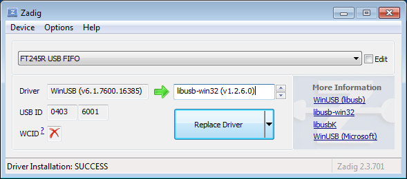

# relay_ft245r

*relay_ft245r* is a Python module to control relay boards based on the 
FTDI FT245R chip. A popular example is the Sainsmart USB relay board.


# How to use *relay_ft245r*

Example code:

```python
import relay_ft245r
import sys
import time

rb = relay_ft245r.FT245R()
dev_list = rb.list_dev()

# list of FT245R devices are returned
if len(dev_list) == 0:
    print('No FT245R devices found')
    sys.exit()
    
# Show their serial numbers
for dev in dev_list:
    print(dev.serial_number)

# Pick the first one for simplicity
dev = dev_list[0]
print('Using device with serial number ' + str(dev.serial_number))

# Connect and turn on relay 2 and 4, and turn off
rb.connect(dev)
rb.switchon(2)    
rb.switchon(4)
time.sleep(1.0)
rb.switchoff(2)    
time.sleep(1.0)
rb.switchoff(4)
```

# Installation

There's no need to "install" *relay_ft245r.py*. Just put it in the same
directory as the Python program that will call it.

But it does need PyUSB and, for Linux, a udev rule to be added or 
Windows, the libusb-win32 driver to be installed and configured.

## Installing PyUSB

relay_ft245r uses the PyUSB Python module to control USB devices. To add 
to your base Python installation, do:

```bash
sudo pip install pyusb
```

## Linux: Update udev rules

To control USB devices without having to be the root user, two things 
are required: 1) you must be part of the "plugdev" group, and 2) the 
FTDI device has to be part of the "plugdev" group.

### Adding user to plugdev

Check which groups your user login belongs to:

```bash
groups
```

If this list includes "plugdev", go on to the next step. Othewise, do 
this command except replace <user> with your user name:

```bash
sudo useradd -G plugdev <user>
```

### Adding a udev rule

Add a file called */lib/udev/rules.d/60-relay_ft245r.rules* with the 
contents below. This example uses nano editor:

```bash
sudo nano /lib/udev/rules.d/60-relay_ft245r.rules
```

Enter the text below as a single line:

```
SUBSYSTEM=="usb", ATTR{idVendor}=="0403", ATTR{idProduct}=="6001", GROUP="plugdev", MODE="660", ENV{MODALIAS}="ignore"
```

Unplug **All** FTDI devices from USB and reattach so that this new rule 
is executed for each FTDI device.

## Windows: Add libusb-win32 and configure

On Windows, PyUSB calls into the libusb-win32 driver. 

### Install Zadig

Zadig is the easiest way in Windows to install libusb-win32 and select
it as the driver assigned to the FT245R board. Go to 
http://zadig.akeo.ie/ and download and install Zadig.

* Run the program
* Click on "Options" and then "Show All Devices"
* Back on the main dialog, select "FT245R USB FIFO" in the dropdown
* Confirm that USB ID shows **0403** and **6001**
* In the pick list specify "libusb-win32"
* Click on the Replace Driver button
* Answer any popup dialogs that show up

This replaces WinUSB for libusb-win32 as the driver to control the board. The 
dialog should look like this before you press *Replace Driver*:



# Troubleshooting

## ValueError: The device has no langid

This error happens in Linux when the program does not have permission to 
access the port. (The error is a side effect and is misleading.) Fix the 
udev rule as documented above.

To confirm it is a user permission issue, try using *sudo* in front of 
the command to run as superuser. If it works, then it is a permissions 
issue with the device.

Sometimes, you need to reboot the computer; logging in and out doesn't 
seem to set the new user permissions.

## usb.core.USBError: [[Errno 16]] Resource busy

Cannot take control of the USB device. Many possible causes:

* The device is attached to another driver (for example, if you are 
  running a virtual machine and the device is presently connected to that 
  virtual machine)

## TypeError: unbound method ... must be called with...

Correct:

```python
rb = relay_ft245r.FT245R()
```

Incorrect:

```python
rb = relay_ft245r.FT245R
```

The second one calls out the object template instead of an object instance.

# Origins

The original code for this came from https://github.com/xypron/pyrelayctl
authored by Heinrich Schuchardt.

I made these changes:

1. Cleaner implementation as object oriented code (didn't need to keep 
passing the device handle)

2. Made it compatible with Python on Windows

3. Fixed a race condition. On Windows, PyUSB runs slow and the relays
where not set reliably on some boards. Probably the bit
masking is not reliable (the USB readstatus() may be happening before
the previous USB write happened) so I restructured the code to only
read the relay state once on connect().

This was tested on Linux Mint 18.3 (Debian) and Windows 7 Professional. It 
should work fine on Raspberry Pi (Debian) and Windows 10, etc.

# License

```
# Copyright (c) 2016, Heinrich Schuchardt <xypron.glpk@gmx.de>
# Copyright (c) 2018, Vince Patron <vince@patronweb.com>
# All rights reserved.
#
# Redistribution and use in source and binary forms, with or without
# modification, are permitted provided that the following conditions are met:
#
#     * Redistributions of source code must retain the above copyright
#   notice, this list of conditions and the following disclaimer.
#
#     * Redistributions in binary form must reproduce the above copyright
#   notice, this list of conditions and the following disclaimer in the
#   documentation and/or other materials provided with the distribution.
#
# THIS SOFTWARE IS PROVIDED BY THE COPYRIGHT HOLDERS AND CONTRIBUTORS "AS IS"
# AND ANY EXPRESS OR IMPLIED WARRANTIES, INCLUDING, BUT NOT LIMITED TO, THE
# IMPLIED WARRANTIES OF MERCHANTABILITY AND FITNESS FOR A PARTICULAR PURPOSE
# ARE DISCLAIMED. IN NO EVENT SHALL THE COPYRIGHT HOLDER BE LIABLE FOR ANY
# DIRECT, INDIRECT, INCIDENTAL, SPECIAL, EXEMPLARY, OR CONSEQUENTIAL DAMAGES
# (INCLUDING, BUT NOT LIMITED TO, PROCUREMENT OF SUBSTITUTE GOODS OR SERVICES;
# LOSS OF USE, DATA, OR PROFITS; OR BUSINESS INTERRUPTION) HOWEVER CAUSED AND
# ON ANY THEORY OF LIABILITY, WHETHER IN CONTRACT, STRICT LIABILITY, OR TORT
# (INCLUDING NEGLIGENCE OR OTHERWISE) ARISING IN ANY WAY OUT OF THE USE OF THIS
# SOFTWARE, EVEN IF ADVISED OF THE POSSIBILITY OF SUCH DAMAGE.
#
# ORIGINAL: https://github.com/xypron/pyrelayctl
#
# CHANGELOG:
#   18/06/12 vpatron
#      Made compatible with Windows. Converted to object style. Excludes FT232
#      boards. See https://github.com/vpatron/relay_ft245r
```
